# Flower Market
> Created to demonstrate responsive design and semantic HTML based on a real Figma prototype.
  - 📂 GitHub Repository : https://github.com/asmasultana07/assignment_02_Responsive-Flowers
  - 🌐 Live Link : https://asmasultana07.github.io/assignment_02_Responsive-Flowers/

---
## Main Requirements
- Navbar Section
- Banner Section
- Plants Section
- Plants Lover Section
- Join Section
- Footer Section
  
## Challenges Task
- Latest Deal Section
- Trusted Plant Lover Badge

  
## Figma UI designs with Mobile Responsiveness
 
#### The Navbar and Banner  

| Desktop view                  | Mobile view                   |
|------------------------------ |-------------------------------|
| 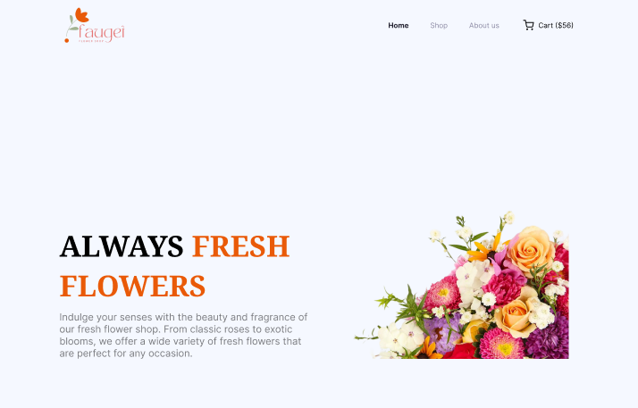    | 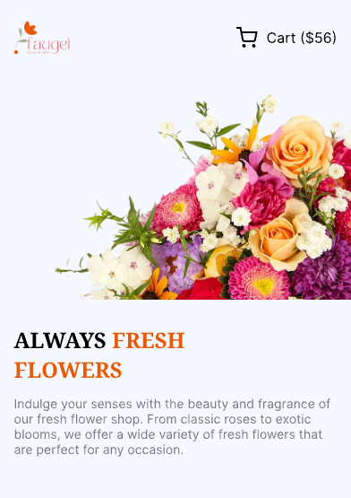 |

#### The Plants      

| Desktop view                  | Mobile view                   |
|------------------------------ |-------------------------------|
| 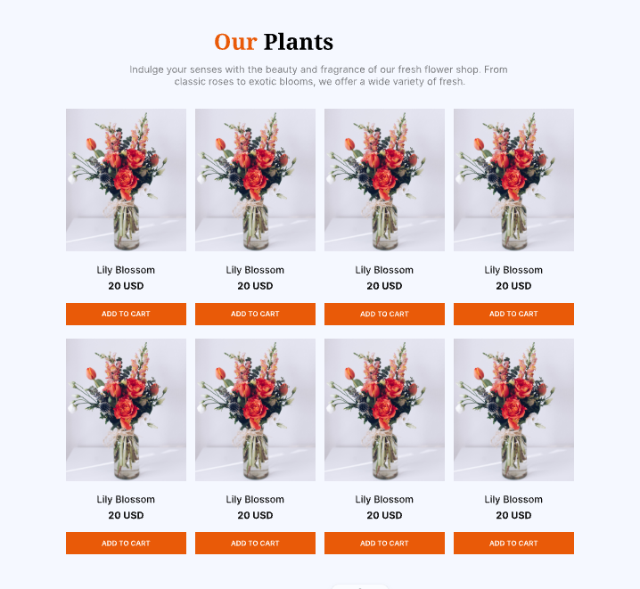        | 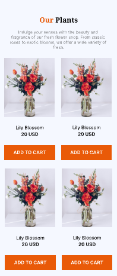     |

#### The Plants Lover 

| Desktop view                  | Mobile view                   |
|------------------------------ |-------------------------------|
| 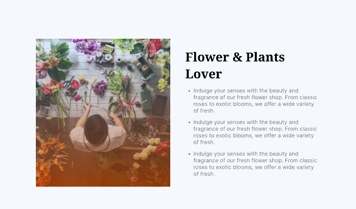 | 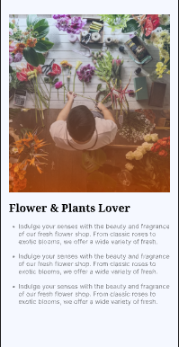 |

#### The Join 

| Desktop view   &  Mobile view                  |
|------------------------------------------------|
|                            |

#### The Footer 

| Desktop view                  | Mobile view                   |
|------------------------------ |-------------------------------|
| 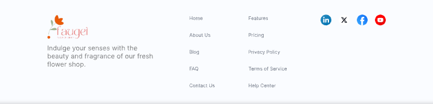      | 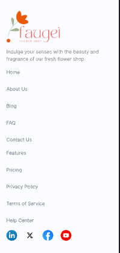   |

### Challenges Task

#### The Latest Deal 
| Desktop view                          | Mobile view                           |
|-------------------------------------- |---------------------------------------|
| 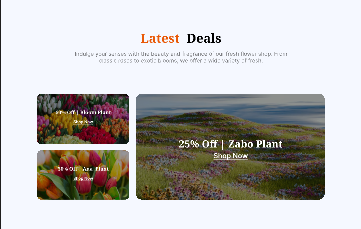    | 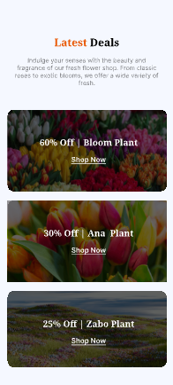 |

#### Trusted Plant Lover Badge
  - Position a Trusted badge at the Plant Lover Image as Figma
  - Mobile Responsiveness: Hide the Trusted badge in Mobile Device 

| Desktop view                          | Mobile view                           |
|-------------------------------------- |---------------------------------------|
| 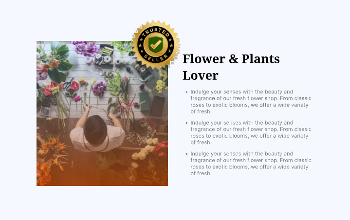                |       |

---

## Tech Stack

| Layer         | Technology                      |
|-------------- |---------------------------------|
| Frontend      | HTML, CSS(Vanilla/ Talwind CSS) |
| Version Ctrl  | Git, GitHub                     |

> ⚙️ Built as part of a web systems project by Programming Hero.

---
